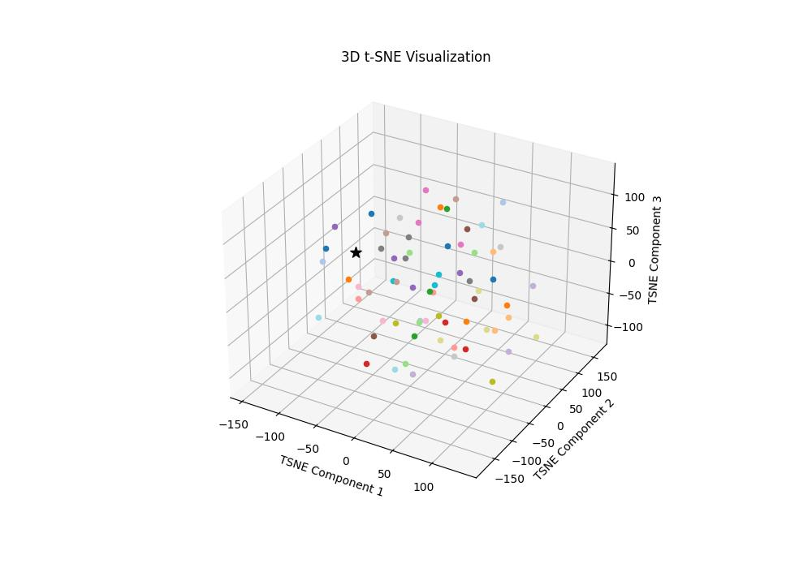
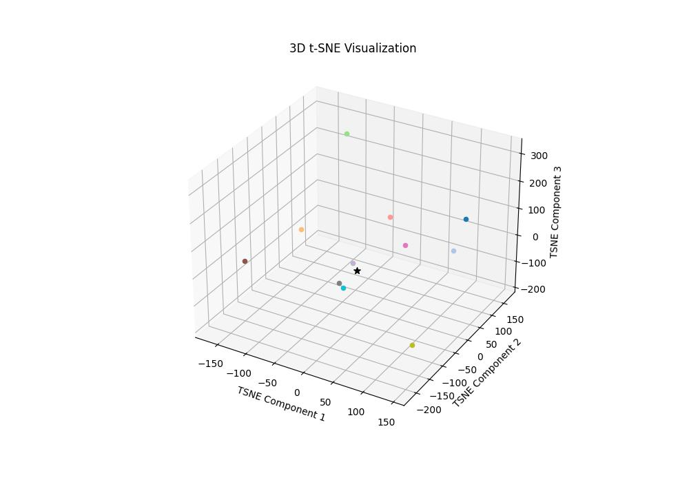

# RAG System for Retrieving Governmental Laws Based on User Case Descriptions

This repository contains a **Retrieval-Augmented Generation (RAG)** system designed to help users retrieve and understand governmental laws related to their specific cases.  
The system leverages advanced natural language processing (NLP) techniques to provide accurate and relevant legal information.

---

## ✨ Features
- **Document Retrieval**: Efficiently retrieves relevant legal documents based on user queries.  
- **Natural Language Understanding**: Utilizes state-of-the-art NLP models to comprehend and process user inputs.  
- **Contextual Responses**: Generates context-aware responses to user inquiries using the [`core42/jais-13b-chat`](https://huggingface.co/core42/jais-13b-chat) model from Hugging Face.  
- **Data Storage**: Stores and retrieves legal and sensitive data locally using **ChromaDB**.  

---

## ⚠️ Important Note
This project is intended for **educational and informational purposes only**.  
The legal data used in this project is private and will not be shared or distributed.  
Users should always consult a **qualified legal professional** for actual legal advice.  

➡️ You can use your own data with the system by replacing the provided dataset.

---

## 🔧 Installation

1. **Clone the repository**:
   ```bash
   git clone https://github.com/Mahmoud-Abu-Zubaidah/RAG4Law
   cd RAG4Law
   ```

2. **Install dependencies**:
   ```bash
   pip install accelerate bitsandbytes sentence-transformers transformers langchain_chroma langchain_community python-dotenv
   ```
   - You may need to install `torch` and `torchvision` separately depending on your system.  
     Please refer to the [official PyTorch installation guide](https://pytorch.org/get-started/locally/).  

   - If installation issues occur, it is recommended to use a **Conda environment**:
     ```bash
     conda install -c conda-forge {package_name}
     ```
     Some packages may not be available on Conda and should be installed via `pip`.

3. **Set environment variables**:  
   Update the `.env` file with your configuration (see details below).

4. **Run the application**:
   ```bash
   python main.py
   ```

---

## 📂 Project Files
- `main.py`: Entry point for running the RAG system.  
- `generator.py`: Functions for generating responses using the language model.  
- `vectorizer.py`: Handles vectorization and storage of documents in the vector database.  
- `RAG.py`: Core implementation of the Retrieval-Augmented Generation system.  
- `preparing_laws.py`: Prepares and processes legal documents before vectorization.  

---

## 📁 Directory Structure
```
RAG4Law/
│── data/
│   ├── images/
│   ├── policies/
│   │   └── Cybercrime_laws.txt
│   └── chroma.sqlite3
│── .env
│── main.py
│── generator.py
│── vectorizer.py
│── RAG.py
│── preparing_laws.py
│── README.md
```

---

## ⚙️ Environment Variables
Set the following variables in your `.env` file:

- `laws_dir`: Directory where processed laws will be stored.  
- `embedding_model_name`: Name of the embedding model.  
- `VectorDB_Name`: Name of the vector database.  
- `V_DB_dir`: Path to store ChromaDB files.  
- `decoder_model_name`: Name of the model used for response generation.  
- `hugging_face_key`: Your Hugging Face API key.  
- `text_file_path`: Path to the raw legal text file (before preprocessing).  
- `output_file_path`: Path to save the processed legal document.  

⚠️ **Note**: If you do not want to preprocess the data, place your files directly in `laws_dir` and comment out the `preprocess_laws()` line in `main.py`.

---

## 📊 Sample Results
The **star** (⭐) represents the user query, while the **circles** (⚪) represent retrieved documents from the vector database.

 
